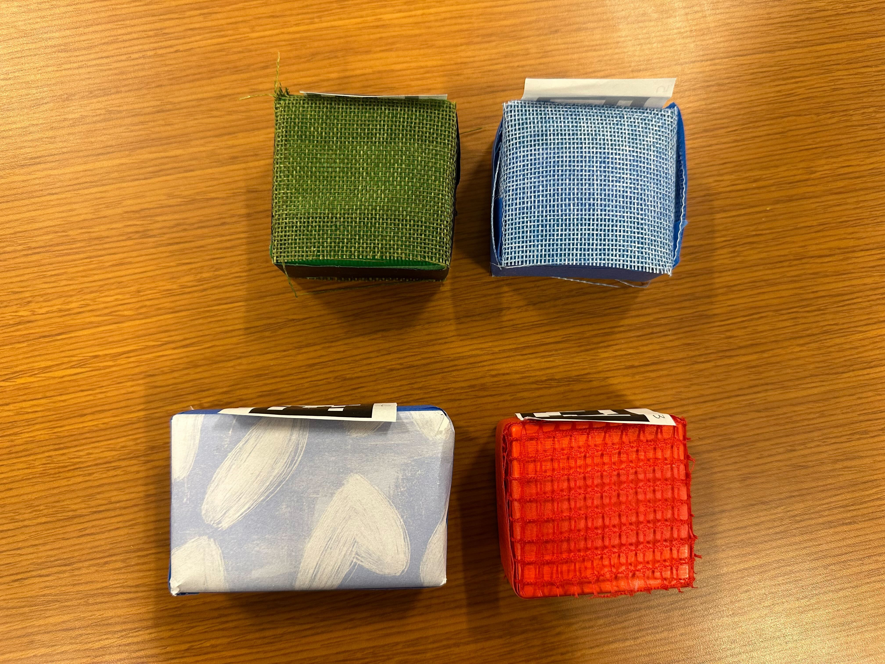
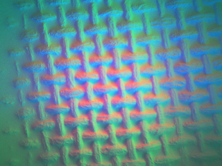
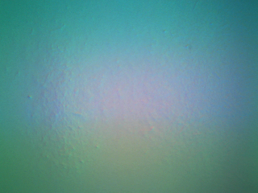
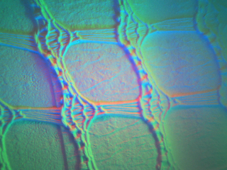

# texture_sort

ROS 2 workspace for texture-based object sorting with a Kinova Gen3 arm and delivery via an AVA mobile robot. The Kinova machine (ROS 2 Jazzy) classifies objects by tactile texture and hands delivery goals off to the AVA robot (ROS 2 Humble) over the network.

---

## Texture Classes



| Color | Texture class |
|---|---|
| Green (top-left) | Dense |
| Blue (top-right) | Dense |
| Red (bottom-right) | Square |
| Blue-white-hearts (bottom-left) | Smooth |

**GelSight sensor readings per class**

| Dense | Smooth | Square |
|---|---|---|
|  |  |  |

---

## Repository Structure

```
texture_sort/
├── src/
│   ├── bringup/                  # Launch files and shared config (system_params.yaml)
│   ├── interfaces/               # Custom ROS 2 msgs, srvs, and actions
│   │   ├── action/               # Delivery, ExecuteGrasp, ExecutePlace, GoToPrePose, LoadObjectIntoBox
│   │   ├── msg/                  # ObjectGrounding, TextureClassification, TaskState, …
│   │   └── srv/                  # StartSortAndDelivery, ClassifyTexture, DetectObjectPose, …
│   ├── manipulation/             # grasp_node, place_node (MoveIt 2)
│   ├── perception/               # GelSight tactile node, tactile classifier, wrist camera, AprilTag overlay
│   ├── task_manager/             # Orchestration node — exposes /start_classify_and_delivery
│   └── third_party/
│       ├── kinova/               # Vendored Kinova ROS 2 packages (ros2_kortex, ros2_control stack, …)
│       ├── ros2_kortex_vision/   # Kinova wrist camera driver  [submodule]
│       └── gsrobotics/           # GelSight Mini driver        [submodule]
```

**Submodules (this repo)**

| Path | Remote |
|---|---|
| `src/third_party/kinova/ros2_kortex` | https://github.com/Kinovarobotics/ros2_kortex (branch: jazzy) |
| `src/third_party/ros2_kortex_vision` | https://github.com/Kinovarobotics/ros2_kortex_vision |
| `src/third_party/gsrobotics` | https://github.com/helenlu66/gsrobotics |

---

## Key Files by Component

**MoveIt 2** — motion planning for grasp and place
- [src/manipulation/manipulation/grasp_node.py](src/manipulation/manipulation/grasp_node.py)
- [src/manipulation/manipulation/place_node.py](src/manipulation/manipulation/place_node.py)
- [src/bringup/launch/system_bringup.launch.py](src/bringup/launch/system_bringup.launch.py) (launches MoveIt via `kinova_gen3_7dof_robotiq_2f_85_moveit_config`)

**Nav2** — mobile robot navigation (AVA side, see `ava_nav_ros2_ws`)
- `src/nav2_demo/` — delivery action client that sends goals to Nav2
- [src/interfaces/action/Delivery.action](src/interfaces/action/Delivery.action) — action interface used between task manager and Nav2 demo node

**Perception** — object detection and localization
- [src/perception/perception/apriltag_overlay.py](src/perception/perception/apriltag_overlay.py) — AprilTag detection overlay and `/groundings` publisher
- [src/perception/perception/wrist_camera_qos_relay.py](src/perception/perception/wrist_camera_qos_relay.py) — QoS bridge for the Kinova wrist camera
- [src/perception/perception/kinova_wrist_cam_node.py](src/perception/perception/kinova_wrist_cam_node.py) — wrist camera node
- [src/bringup/config/system_params.yaml](src/bringup/config/system_params.yaml) — shared config for all nodes

**Custom components** — tactile sensing pipeline
- [src/perception/perception/gelsight_node.py](src/perception/perception/gelsight_node.py) — GelSight Mini camera driver node
- [src/perception/perception/tactile_classification_utils.py](src/perception/perception/tactile_classification_utils.py) — feature extraction and inference utilities
- [src/perception/perception/tactile_resnet_nn.pt](src/perception/perception/tactile_resnet_nn.pt) — trained ResNet weights
- [src/interfaces/srv/ClassifyTexture.srv](src/interfaces/srv/ClassifyTexture.srv) — service interface for texture classification
- [src/interfaces/srv/StartSortAndDelivery.srv](src/interfaces/srv/StartSortAndDelivery.srv) — top-level trigger service
- [src/task_manager/task_manager/task_manager_node.py](src/task_manager/task_manager/task_manager_node.py) — orchestration node

**Manually written node** — tactile classifier
- [src/perception/perception/tactile_node.py](src/perception/perception/tactile_node.py) — serves `ClassifyTexture` requests by capturing a GelSight image and running the ResNet classifier

---

## Kinova Side — Installation

**Prerequisite:** ROS 2 Jazzy installed and sourced.

```bash
# 1. Clone the repo
git clone https://github.com/helenlu66/texture_sort.git
cd texture_sort

# 2. Pull all submodules
git submodule update --init --recursive
```

---

## Kinova Side — Build & Launch

```bash
# Source in every new terminal
source /opt/ros/jazzy/setup.bash
source ~/texture_sort/install/setup.bash
export RMW_IMPLEMENTATION=rmw_cyclonedds_cpp
export ROS_DOMAIN_ID=42
```

**Build**

```bash
cd ~/texture_sort
colcon build --symlink-install
source install/setup.bash
```

**Terminal 1 — Kinova arm + MoveIt 2**

```bash
ros2 launch kinova_gen3_7dof_robotiq_2f_85_moveit_config robot.launch.py \
  robot_ip:=192.168.1.10 \
  use_fake_hardware:=false
```

**Terminal 2 — Full perception + manipulation bringup**

```bash
ros2 launch bringup system_bringup.launch.py
```

This starts: RealSense external camera, Kinova wrist camera, wrist-camera QoS relay, AprilTag detector, AprilTag overlay, GelSight tactile node, tactile classifier, grasp node, place node, and the task manager.

---

## AVA Side — Installation

**Prerequisite:** ROS 2 Humble installed and sourced.

```bash
# 1. Clone the AVA workspace
git clone --branch main https://github.com/helenlu66/ava_nav_ros2_ws.git
cd ava_nav_ros2_ws

# 2. Pull all submodules
git submodule update --init --recursive
```

---

## AVA Side — Build & Launch

```bash
# Source in every new terminal
source /opt/ros/humble/setup.bash
source ~/ava_nav_ros2_ws/install/setup.bash
export RMW_IMPLEMENTATION=rmw_cyclonedds_cpp
export ROS_DOMAIN_ID=42
```

**Build**

```bash
cd ~/ava_nav_ros2_ws
colcon build --symlink-install
source install/setup.bash
```

**Terminal 1 — Start the AVA robot**

```bash
ros2 launch ava_bringup ava_bringup.launch.py
```

**Terminal 2 — Nav2 with the HRI main lab map**

```bash
ros2 launch nav2_bringup bringup_launch.py \
  map:=/path/to/hri_main_lab_map_3.yaml \
  use_sim_time:=false
```

**Terminal 3 — Nav2 demo delivery node**

```bash
ros2 launch nav2_demo nav2_demo.launch.py
```

---

## Trigger Sort-and-Deliver (Kinova Terminal 3)

Once both sides are running, kick off the classify-and-deliver pipeline from the Kinova machine:

```bash
# Source first (see Kinova source block above)
ros2 service call /start_classify_and_delivery interfaces/srv/StartSortAndDelivery "{}"
```

The task manager will classify each object on the table by texture, load the square texture objects and dense texture objects onto the AVA in 2 batches, and send delivery goals to the AVA robot. The smooth object will be left on the table. 
